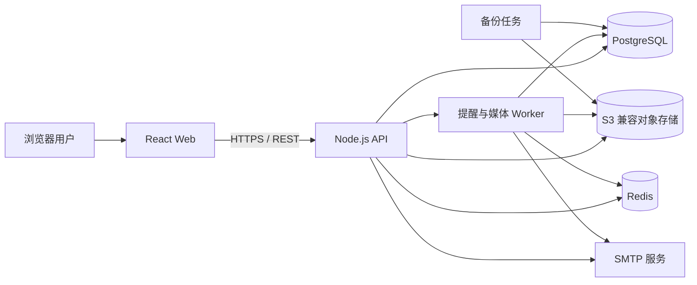
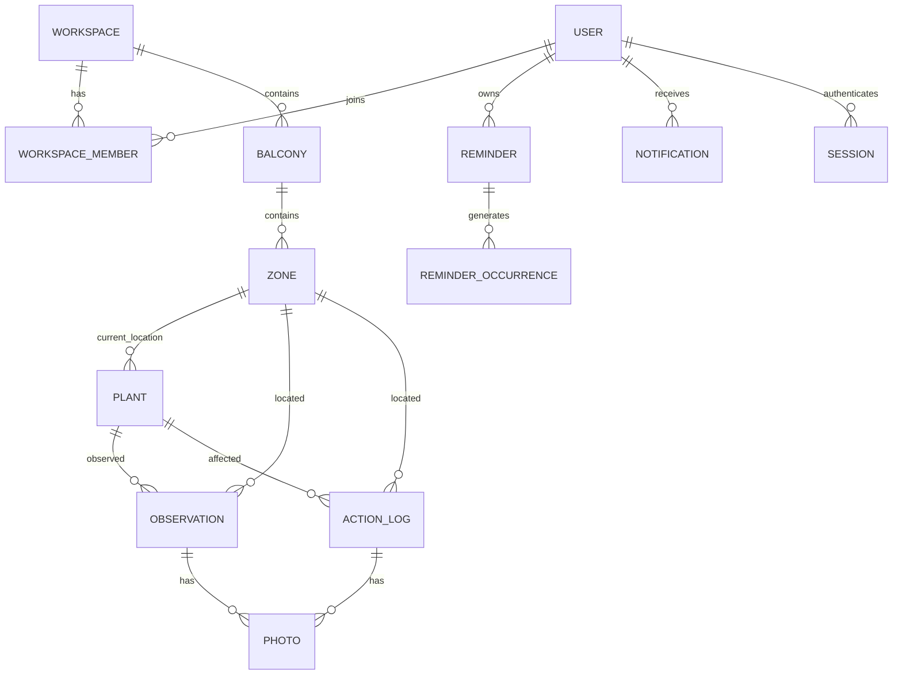

# 阳台微气候记录工具 — 项目文档

> 文档状态：实施基线  
> 产品形态：可直接部署、供真实用户持续使用的 Web 应用，不是静态演示、示例页或仅能运行于本机的原型  
> 前端：React + TypeScript  
> 后端：Node.js + TypeScript  
> 核心目标：记录阳台不同位置的温度、光照、风向和植物状态，并可靠比较遮阳、浇水、换盆等操作前后的变化，同时提供可持续触达的提醒。

---

## 1. 文档目标与交付原则

本文档是整个项目的需求、设计、实现、测试、部署和验收基线。后续开发必须围绕本文档闭环交付，不能以“页面能打开”“接口返回假数据”“本地演示通过”作为完成标准。

项目完成必须同时满足以下原则：

1. **真实数据闭环**：用户注册后创建真实阳台、位置、植物、观察记录和操作记录；数据写入 PostgreSQL，刷新页面或重启服务后仍可查询。
2. **真实媒体闭环**：用户可上传真实照片；照片写入对象存储，生成缩略图和稳定元数据，可被授权用户查看、比较和删除。
3. **真实分析闭环**：温度、光照、风向、植物状态由真实记录计算；数据不足时明确提示不可比较，不生成伪造曲线或结论。
4. **真实提醒闭环**：提醒持久化，由后台 Worker 按用户时区和规则触发；用户能够查看、完成、稍后提醒或关闭提醒。
5. **真实部署闭环**：通过容器化环境启动前端、API、Worker、数据库、Redis 和对象存储；有迁移、健康检查、日志、备份和恢复流程。
6. **真实验收闭环**：以端到端场景、数据库持久化、重启恢复、权限隔离和异常处理作为验收依据，不以 UI 截图代替验收。
7. **无演示占位**：正式环境不自动注入虚构用户、虚构植物或“演示数据”；只提供真实的空状态引导和首次配置流程。

---

## 2. 产品定位

### 2.1 一句话定义

面向阳台种植用户的微气候日志和干预效果分析工具：在阳台不同位置持续记录环境与植物状态，并用统一时间轴比较遮阳、浇水、换盆等操作带来的真实变化。

### 2.2 解决的问题

- 同一阳台不同位置的日照、温度和风况差异很大，凭记忆很难判断。
- 用户做了遮阳、浇水、换盆后，容易把短期波动误判为长期改善。
- 照片分散在相册中，缺少与位置、时间、植物和操作关联，难以进行同视角对照。
- 浇水、换盆、持续观察等事项容易遗忘，缺少与植物真实状态联动的提醒。
- 对“变化是否可信”缺少数据覆盖度和缺失值提示，容易得出过度结论。

### 2.3 目标用户

- 城市家庭阳台种植者。
- 同时照料多个位置和多种植物的深度用户。
- 需要记录环境干预效果的植物爱好者。
- 为家人或少量多人协作维护同一阳台的用户。

### 2.4 核心用户故事

1. 我可以创建多个阳台，并给每个阳台划分东侧、西侧、栏杆、室内侧等不同位置。
2. 我可以录入每次观察的时间、位置、温度、光照、风向和植物状态。
3. 我可以把照片与观察记录或操作记录关联，并在以后按植物、位置和时间查找。
4. 我可以记录遮阳、浇水、换盆、搬动、施肥、修剪等操作。
5. 我可以查看某个位置或植物的日、周、月趋势曲线。
6. 我可以选择一次操作，自动比较操作前后固定时间窗口的数据和照片。
7. 我可以设置按周期、指定时间或环境阈值触发的提醒。
8. 我可以在提醒到期后完成、跳过、稍后提醒或关闭规则。
9. 我可以导出自己的数据，也可以删除账号及关联数据。
10. 除我明确邀请的成员外，其他人无法访问我的阳台数据。

### 2.5 产品核心闭环

**建立空间 → 建立植物 → 持续记录 → 执行干预 → 自动对照 → 调整计划 → 再次记录 → 周期性提醒**

每个环节都必须能落到持久化数据，并能在 UI 中查看结果。

---

## 3. 版本范围

### 3.1 V1 必须交付

- 邮箱注册、登录、退出、修改密码、忘记密码。
- 多用户数据隔离，可选阳台成员邀请。
- 多阳台、阳台位置管理。
- 植物档案与当前所属位置。
- 环境观察记录：温度、光照、风向和植物状态。
- 干预操作记录：遮阳、浇水、换盆、搬动、施肥、修剪和自定义操作。
- 照片上传、缩略图、按时间浏览、与记录关联、干预前后对照。
- 温度、光照、风向、植物健康趋势曲线。
- 干预前后统计对比和数据覆盖度提示。
- 持久化提醒：周期提醒、单次提醒、环境阈值提醒。
- 站内通知；SMTP 邮件通知作为可配置渠道。
- 仪表盘、时间轴、植物详情、位置详情、提醒中心、设置页。
- CSV/JSON 数据导出、账号删除、数据备份与恢复。
- Docker Compose 本地/私有部署和标准生产部署脚本。
- 健康检查、结构化日志、错误处理、迁移和基本监控指标。

### 3.2 明确不在 V1 范围

- 自动接入温度计、光照计、风速仪等 IoT 设备。
- 用 AI 诊断病虫害或替代专业园艺建议。
- 社区、关注、点赞、公开分享广场。
- 付费订阅、广告和电商。
- iOS/Android 原生应用。
- 自动控制遮阳帘、灌溉设备。
- 精确天气预报和跨城市气候数据库。
- 复杂的气象学建模或因果推断。

### 3.3 V1 之后的优先扩展

- 设备自动采集与校准。
- PWA 离线补录和系统级推送。
- 同视角照片辅助对齐。
- 多成员协作权限细化。
- 更丰富的植物养护模板。
- 基于个人历史数据的个性化提醒建议。

---

## 4. 核心概念与数据口径

| 概念 | 定义 | 关键约束 |
|---|---|---|
| 阳台 `Balcony` | 一个物理阳台或种植区域 | 归属于一个用户或一个协作空间 |
| 位置 `Zone` | 阳台内可重复记录的具体位置 | 必须属于某个阳台，名称在阳台内唯一 |
| 植物 `Plant` | 用户持续照料的植物实例 | 记录时保存明确位置，允许当前位置变化 |
| 环境观察 `Observation` | 某个时间点在一个位置记录的环境和植物状态 | 必须指定阳台和位置；植物可选；时间不能是伪造的未来时间 |
| 干预操作 `Action` | 用户在某个时间执行的养护或环境调整 | 必须指定类型、执行时间和作用范围 |
| 照片 `Photo` | 与观察、操作、植物或位置关联的真实媒体 | 原图和缩略图分离存储；删除采用可恢复的软删除 |
| 提醒规则 `Reminder` | 描述何时提醒以及提醒谁的规则 | 保存用户时区、触发方式和冷却时间 |
| 提醒事件 `ReminderOccurrence` | 某次实际到期的提醒 | 同一规则同一到期时间只能产生一条待处理事件 |
| 通知 `Notification` | 面向用户展示的站内或邮件消息 | 站内必达于数据库；邮件失败不丢失站内通知 |
| 干预对比 `Comparison` | 以一次操作为锚点，比较前后固定窗口 | 结果必须返回覆盖度、缺失值和可比较状态 |

### 4.1 单位和字段口径

- 时间统一以 UTC `timestamptz` 存储，前端按用户时区显示。
- 温度统一存储为摄氏度 `decimal(5,2)`；V1 前端只输入摄氏度，后续可扩展华氏度展示。
- 光照同时支持：
  - `light_level` 枚举：`DARK`、`LOW`、`INDIRECT`、`BRIGHT`、`DIRECT`。
  - `lux` 可选数值；有仪表时录入，没有仪表时只录枚举。
- 风向支持 16 方位枚举和可选的 `wind_degrees`（0–359）。
- 风速可选，单位 `m/s`。
- 植物状态使用 `HEALTHY`、`WATCH`、`CONCERN`、`CRITICAL` 四级，并允许补充叶色、萎蔫、黄叶、花苞、结果、虫害等标签。
- 土壤湿度可选，采用 0–100 的相对百分比，必须标明是“估算”还是“仪器读数”。
- 所有用户输入都必须带单位提示，禁止无单位数值直接进入统计。

---

## 5. 角色与权限

| 角色 | 权限 |
|---|---|
| 游客 | 注册、登录、找回密码 |
| 所有者 `OWNER` | 阳台全部管理、成员管理、提醒、导出、删除 |
| 协作者 `EDITOR` | 创建和编辑观察、操作、照片、植物；不能删除阳台和管理成员 |
| 只读成员 `VIEWER` | 查看数据、曲线和照片；不能修改 |
| 系统 Worker | 评估到期提醒、发送通知、生成缩略图、清理临时文件；不读取无关数据 |

权限规则：

- 资源必须同时校验用户身份和空间成员关系，不能只依赖前端隐藏按钮。
- 删除成员后，其访问令牌授权立即失效；已产生的审计记录保留。
- 所有主资源必须带 `owner_user_id` 或 `workspace_id`，所有查询必须带作用域条件。
- 公开 URL 中禁止暴露可遍历的内部文件路径和数据库 ID 语义。
- 照片访问使用短时签名 URL，默认有效期 10 分钟。

---

## 6. 用户流程

### 6.1 首次使用

1. 用户注册并设置时区、温度单位和默认提醒渠道。
2. 系统进入真实空状态，不注入演示数据。
3. 用户创建第一个阳台。
4. 用户添加至少一个位置，例如“东侧栏杆”“西侧窗台”。
5. 用户可选择立即添加植物，或先完成第一条环境观察。
6. 首次保存后，仪表盘出现真实记录卡片和下一步操作。

### 6.2 日常记录

1. 用户进入“记录”页。
2. 选择阳台和位置；系统记住上一次选择，但每次提交时明确展示当前选择。
3. 输入温度、光照、风向、风速和植物状态。
4. 可选关联植物、添加备注和照片。
5. 系统校验后写入数据库，并刷新时间轴、仪表盘和曲线。
6. 如果记录触发阈值提醒，Worker 在去重和冷却后生成通知。

### 6.3 记录一次干预

1. 用户选择“遮阳”“浇水”“换盆”等操作类型。
2. 选择位置和/或植物，填写执行时间和参数。
3. 可上传操作前后照片。
4. 操作保存后生成操作时间线节点。
5. 系统提供“7 天前后对比”入口；用户也可以手动选择窗口。
6. 无足够前后数据时，页面显示“尚不可比较”，而不是生成默认结论。

### 6.4 照片对照

1. 用户从植物详情或某次干预进入“照片对照”。
2. 系统按时间排序，并优先推荐操作前最近一张和操作后最近一张。
3. 用户可切换任一时间点进行并排或滑动对比。
4. 页面显示照片拍摄时间、位置、操作标签、备注和授权状态。
5. 用户可调整对比窗口，但不得修改历史照片时间元数据。

### 6.5 提醒处理

1. 用户创建提醒规则，设置触发方式、时间、重复周期和通知渠道。
2. Worker 按分钟扫描到期任务，原子领取并生成提醒事件。
3. 站内通知写入数据库；邮件开启时异步发送。
4. 用户在提醒中心执行“完成”“跳过本次”“10 分钟后再提醒”或“停用规则”。
5. “完成”会写入对应操作或观察记录，并计算下一次提醒时间。
6. 所有状态变化可审计，重复任务不会产生重复通知。

### 6.6 数据导出与账号删除

1. 用户可发起异步导出，生成个人 JSON 和 CSV 压缩包。
2. 导出文件使用短时下载地址，过期后删除。
3. 账号删除需要二次确认和密码验证。
4. 删除进入 7 天冷静期；期间可撤销。到期后删除账号、业务数据、照片和导出文件，仅保留法律或审计要求的最小记录。

---

## 7. 总体架构

### 7.1 技术基线

| 层 | 选型 | 说明 |
|---|---|---|
| Web | React 19 + TypeScript + Vite | SPA；使用严格类型和路由级代码分割 |
| UI | Ant Design + 自定义主题 | 表单、表格、日期、上传和可访问性基础完整 |
| 数据请求 | TanStack Query | 请求缓存、失效、重试、乐观更新边界明确 |
| 表单 | React Hook Form + Zod | 前后端共享字段规则；后端最终校验 |
| 图表 | Recharts | 温度、光照、风向和状态趋势 |
| API | Node.js 22 LTS + Fastify + TypeScript | REST API、上传、鉴权、限流和健康检查 |
| ORM | Prisma | 可审查迁移、类型安全查询 |
| 数据库 | PostgreSQL 16+ | 事务、约束、时间序列查询和审计 |
| 队列 | Redis 7 + BullMQ | 提醒扫描、邮件、导出、缩略图和清理任务 |
| 对象存储 | MinIO 或 S3/R2 | 原图、缩略图、导出文件；开发和生产采用同一接口 |
| 邮件 | SMTP Provider | 可选但必须提供真实发送配置和管理员测试入口 |
| 测试 | Vitest + Supertest + Playwright | 单元、接口集成、真实浏览器端到端 |
| 部署 | Docker Compose + Nginx | 一套 compose 可完整启动；生产配置 TLS 和资源限制 |

版本实施时以当时的稳定 LTS/主版本为准，并提交 lockfile，禁止无锁安装导致环境漂移。

### 7.2 服务边界

- `web`：只负责展示、表单交互、本地 UI 状态和请求编排；不直接连接数据库。
- `api`：负责认证、授权、业务规则、事务、查询聚合、上传签名或接收、导出申请。
- `worker`：负责无法在请求周期内可靠完成的异步任务，包括提醒扫描、邮件、缩略图、导出和清理。
- `postgres`：唯一事实数据源，不把提醒或用户数据仅保存在 Redis。
- `redis`：只承担队列、锁和短时缓存；Redis 丢失不应导致核心数据丢失。
- `object-storage`：只存文件和元数据引用；数据库记录 `object_key`、大小、MIME 和校验值。

### 7.3 关键请求链路

**普通查询链路**：Web → HTTPS → API 鉴权 → 空间权限 → 参数校验 → PostgreSQL → 响应 DTO。  
**照片上传链路**：Web 请求上传凭证 → 直接上传或上传到 API → 校验真实文件类型与大小 → 对象存储 → 数据库登记 → Worker 生成缩略图 → 前端刷新。  
**提醒链路**：规则创建 → 计算 `next_run_at` → BullMQ 延迟任务/周期扫描 → Worker 原子领取 → 写 `ReminderOccurrence` → 写站内通知 → 可选发邮件 → 用户处理 → 计算下一次。  
**干预对比链路**：操作记录 → API 查询前后窗口 → 去重与聚合 → 返回覆盖度和统计 → Web 叠加曲线和照片 → 用户调整窗口再次查询。

---

## 8. 数据模型

### 8.1 用户与会话

| 表 | 核心字段 | 说明 |
|---|---|---|
| `users` | `id`, `email`, `password_hash`, `display_name`, `timezone`, `locale`, `status`, `created_at`, `deleted_at` | 邮箱统一小写唯一；密码只保存 Argon2id 哈希 |
| `sessions` | `id`, `user_id`, `token_hash`, `expires_at`, `last_seen_at`, `revoked_at`, `ip`, `user_agent` | 服务端会话；Cookie 只保存随机令牌 |
| `password_reset_tokens` | `id`, `user_id`, `token_hash`, `expires_at`, `used_at` | 单次有效，过期自动清理 |
| `workspaces` | `id`, `name`, `owner_user_id`, `created_at` | 默认每个用户自动拥有一个“我的阳台”空间 |
| `workspace_members` | `workspace_id`, `user_id`, `role`, `created_at` | 联合唯一；角色 OWNER/EDITOR/VIEWER |

### 8.2 空间与植物

| 表 | 核心字段 | 说明 |
|---|---|---|
| `balconies` | `id`, `workspace_id`, `name`, `orientation`, `floor`, `notes`, `archived_at` | 阳台档案 |
| `zones` | `id`, `balcony_id`, `name`, `description`, `height_cm`, `azimuth_degrees`, `sun_exposure`, `sort_order`, `archived_at` | 位置是记录和分析的核心维度 |
| `plants` | `id`, `workspace_id`, `zone_id`, `name`, `species`, `variety`, `pot_size_cm`, `acquired_at`, `cover_photo_id`, `status`, `notes`, `archived_at` | 当前位置可变；历史位置由观察记录固定保存 |
| `plant_zone_history` | `id`, `plant_id`, `from_zone_id`, `to_zone_id`, `moved_at`, `action_log_id` | 迁盆或搬动的历史轨迹 |

### 8.3 记录、干预与照片

| 表 | 核心字段 | 说明 |
|---|---|---|
| `observations` | `id`, `workspace_id`, `balcony_id`, `zone_id`, `plant_id?`, `observed_at`, `temperature_c`, `light_level`, `lux?`, `wind_direction`, `wind_degrees?`, `wind_speed_mps?`, `plant_status`, `plant_tags`, `soil_moisture_pct?`, `soil_moisture_source`, `notes`, `client_request_id`, `created_by`, `created_at`, `updated_at`, `deleted_at` | 一次真实观察；`observed_at` 不能晚于服务器当前时间加 5 分钟 |
| `action_logs` | `id`, `workspace_id`, `balcony_id`, `zone_id?`, `plant_id?`, `action_type`, `title`, `started_at`, `completed_at`, `parameters_json`, `notes`, `client_request_id`, `created_by`, `created_at`, `updated_at`, `deleted_at` | 遮阳、浇水、换盆、搬动、施肥、修剪和自定义操作 |
| `photos` | `id`, `workspace_id`, `observation_id?`, `action_log_id?`, `plant_id?`, `zone_id?`, `object_key`, `thumbnail_key`, `original_filename`, `mime_type`, `size_bytes`, `width`, `height`, `sha256`, `captured_at?`, `uploaded_at`, `deleted_at` | 一张照片至少关联一种业务对象；EXIF 定位默认剥离 |
| `tags` / `observation_tags` | `id`, `workspace_id`, `name`, `color` | 可复用植物状态标签 |
| `attachments` | 通用文件记录 | V1 仅用于导出文件和诊断附件，不允许伪装成照片 |

索引与约束：

- `observations(workspace_id, observed_at desc)`。
- `observations(workspace_id, zone_id, observed_at desc)`。
- `observations(workspace_id, plant_id, observed_at desc)`。
- `action_logs(workspace_id, started_at desc)`。
- `photos(workspace_id, captured_at desc)`。
- `users.lower(email)` 唯一。
- `zones(balcony_id, lower(name))` 在未归档数据中唯一。
- `client_request_id` 在用户作用域内唯一，保证重复点击不会产生双记录。
- 所有软删除查询必须显式排除 `deleted_at IS NOT NULL`。

### 8.4 提醒与通知

| 表 | 核心字段 | 说明 |
|---|---|---|
| `reminders` | `id`, `workspace_id`, `user_id`, `title`, `reminder_type`, `target_type`, `plant_id?`, `zone_id?`, `trigger_mode`, `timezone`, `interval_value`, `interval_unit`, `time_of_day`, `threshold_json`, `channel_mask`, `next_run_at`, `cooldown_seconds`, `is_active`, `snooze_minutes`, `created_at`, `updated_at` | 规则定义；所有时间同时保存用户时区语义 |
| `reminder_occurrences` | `id`, `reminder_id`, `due_at`, `status`, `sent_at`, `handled_at`, `snoozed_until`, `dedupe_key`, `error_message` | 状态：PENDING/SENT/SNOOZED/DONE/DISMISSED/FAILED |
| `notifications` | `id`, `user_id`, `occurrence_id?`, `channel`, `title`, `body`, `status`, `read_at`, `sent_at`, `created_at` | 站内通知写入数据库；邮件渠道保留发送结果 |
| `jobs` | `id`, `job_type`, `payload_json`, `status`, `run_at`, `locked_at`, `attempts`, `last_error` | 可选数据库任务追踪；Redis 队列不是唯一事实来源 |

### 8.5 审计与系统

| 表 | 核心字段 | 说明 |
|---|---|---|
| `audit_logs` | `id`, `workspace_id`, `actor_user_id`, `action`, `entity_type`, `entity_id`, `before_json`, `after_json`, `ip`, `created_at` | 记录关键数据变更、权限和删除操作 |
| `export_jobs` | `id`, `user_id`, `status`, `object_key`, `expires_at`, `created_at` | 异步导出与下载 |
| `system_settings` | `key`, `value_json`, `updated_at` | 仅管理员可维护的运行配置 |
| `feature_flags` | `key`, `enabled`, `scope_json` | 控制邮件、邀请等可渐进启用功能 |

---

## 9. 前端设计

### 9.1 路由与页面

| 路由 | 页面 | 核心能力 |
|---|---|---|
| `/login`、`/register`、`/reset-password` | 认证页 | 登录、注册、申请和完成重置 |
| `/onboarding` | 首次使用向导 | 创建阳台、位置、植物；无演示数据 |
| `/` | 仪表盘 | 最新观察、今日提醒、异常状态、快速记录入口 |
| `/journal` | 时间轴 | 观察和操作混合时间轴；按位置、植物、类型筛选 |
| `/record/new` | 新建观察 | 快速录入环境与植物状态；上传照片 |
| `/actions/new` | 新建干预 | 记录遮阳、浇水、换盆等操作 |
| `/balconies` | 阳台管理 | 阳台 CRUD、位置排序、归档 |
| `/balconies/:id/zones/:zoneId` | 位置详情 | 位置信息、趋势、最新照片和关联植物 |
| `/plants` | 植物列表 | 状态筛选、当前位置、下次提醒 |
| `/plants/:id` | 植物详情 | 档案、位置历史、记录、照片、干预、提醒 |
| `/insights` | 数据洞察 | 温度、光照、风向、状态曲线和多对象对比 |
| `/photos/compare` | 照片对照 | 并排、滑动、时间点切换、同植物/位置筛选 |
| `/reminders` | 提醒中心 | 规则 CRUD、待处理事件、完成、跳过、稍后提醒 |
| `/settings` | 设置 | 时区、单位、通知、成员、导出、删除账号 |

### 9.2 页面状态

每个数据页面必须实现以下状态：

- 首次加载骨架屏。
- 有数据状态。
- 真实空状态，并提供下一步操作。
- 请求失败状态，保留重试按钮和错误请求 ID。
- 权限不足状态，不显示虚假内容。
- 已离线/网络异常状态；V1 允许离线查看缓存内容，但写入必须明确失败，不能假装成功。
- 数据过期状态；用户可主动刷新，后台按策略重新拉取。

### 9.3 新建观察表单

必填字段：

- 阳台。
- 位置。
- 观察时间，默认当前时间，可补录但不能设为未来。
- 温度。
- 光照等级。
- 风向。
- 植物状态；没有植物时仍可记录纯环境观察。

可选字段：

- 关联植物。
- 光照数值 `lux`。
- 风向角度、风速。
- 土壤湿度及来源。
- 状态标签和备注。
- 1–6 张照片。

校验规则：

- 温度范围 `-50°C` 到 `70°C`，超出范围要求确认。
- `lux` 为 0–200000。
- 风向角度为 0–359。
- 风速为 0–100 m/s。
- 土壤湿度为 0–100%。
- 照片单张最大 15 MB，最多 6 张；仅允许 JPEG、PNG、WebP、HEIC 的可服务转换格式。
- 服务端必须重复执行全部规则，不能信任前端校验。

### 9.4 仪表盘

必须显示：

- 最近一次观察的环境摘要和时间。
- 当前待处理提醒数量及最近一条。
- 各位置最近 24 小时温度范围。
- 重点关注植物列表。
- 最近一次干预和对比入口。
- “记录一次”“添加操作”“上传照片”三个主要动作。
- 数据新鲜度提示，例如“距上次记录 3 天”。

### 9.5 曲线与统计

- 温度：折线图，支持原始点、小时均值、日均值。
- 光照：枚举分布柱状图；有 `lux` 时提供折线图和峰值。
- 风向：16 方位玫瑰图或方位分布图；避免只用简单折线表达方向。
- 植物状态：按四级状态绘制阶梯线或状态带，并显示标签事件。
- 所有图表显示时间范围、时区、数据点数量和缺失区间。
- 数据点少于 3 个时显示“趋势样本不足”。
- 用户切换筛选条件后，URL 保留筛选参数，便于分享和刷新。

### 9.6 干预对比

用户选择一次操作后，页面默认展示：

- 操作前 7 天、操作后 7 天。
- 温度均值、最小值、最大值、变化值。
- 光照等级分布对比。
- 风向分布对比。
- 植物状态变化和记录次数。
- 照片前后对照入口。

页面必须展示：

- “可比较 / 样本不足 / 前后覆盖不均”的状态。
- 前后有效记录数和缺失位置。
- 对比窗口、计算时区和数据截止时间。
- 统计结果只描述相关变化，不把相关性表述为因果关系。

### 9.7 照片对照

- 支持并排和滑动两种模式。
- 显示拍摄时间、上传时间、位置、植物和操作标签。
- 自动推荐“干预前最近照片”和“干预后最早照片”。
- 用户可以手动切换任意两张已授权照片。
- 原图加载失败时回退缩略图；缩略图失败时显示明确错误，不显示空白占位。
- 删除照片前提示其关联记录；删除后从所有列表和对比中消失。

### 9.8 响应式与可访问性

- 目标屏幕：375 px 手机、768 px 平板、1280 px 及以上桌面。
- 表单在手机端单列，桌面端可双列，但核心字段顺序固定。
- 图表在手机上支持横向滚动或简化视图，不能挤压到不可读。
- 所有操作支持键盘完成；焦点可见；颜色不是状态的唯一表达方式。
- 图片提供可读的替代文本；用户备注可作为主要替代信息。
- 触控目标不小于 44 × 44 px。

---

## 10. API 设计

### 10.1 通用规则

- 前缀：`/api/v1`。
- 鉴权：HttpOnly、Secure、SameSite 会话 Cookie；写请求校验 CSRF Token。
- 内容类型：JSON 默认使用 `application/json`；上传使用 `multipart/form-data`。
- 分页：`cursor` + `limit`，默认 20，最大 100。
- 时间：输入输出使用 ISO 8601 UTC；响应包含用户时区解释。
- 幂等：创建观察和操作支持 `Idempotency-Key` 或 `clientRequestId`。
- 错误：统一返回 `code`、`message`、`fieldErrors`、`requestId`，不向客户端泄漏 SQL 或堆栈。
- 状态码：200/201/202/204、400、401、403、404、409、413、422、429、500、503。

### 10.2 认证与用户

| 方法 | 路径 | 功能 |
|---|---|---|
| POST | `/auth/register` | 注册并创建默认空间 |
| POST | `/auth/login` | 登录并建立会话 |
| POST | `/auth/logout` | 撤销当前会话 |
| GET | `/auth/me` | 当前用户和权限 |
| POST | `/auth/password/forgot` | 申请重置 |
| POST | `/auth/password/reset` | 完成重置 |
| PATCH | `/users/me` | 修改显示名、时区、单位和通知偏好 |
| POST | `/users/me/export` | 创建真实导出任务 |
| DELETE | `/users/me` | 发起 7 天冷静期删除 |
| POST | `/users/me/delete/cancel` | 撤销删除 |

### 10.3 阳台、位置与植物

| 方法 | 路径 | 功能 |
|---|---|---|
| GET/POST | `/balconies` | 列出/创建阳台 |
| GET/PATCH/DELETE | `/balconies/:id` | 查看/修改/归档阳台 |
| GET/POST | `/balconies/:id/zones` | 列出/创建位置 |
| GET/PATCH/DELETE | `/zones/:id` | 查看/修改/归档位置 |
| GET/POST | `/plants` | 列出/创建植物 |
| GET/PATCH/DELETE | `/plants/:id` | 查看/修改/归档植物 |
| POST | `/plants/:id/move` | 搬动植物并生成位置历史 |

### 10.4 观察、操作与照片

| 方法 | 路径 | 功能 |
|---|---|---|
| GET/POST | `/observations` | 时间轴查询/创建观察 |
| GET/PATCH/DELETE | `/observations/:id` | 查看/修改/软删除观察 |
| GET/POST | `/actions` | 查询/创建干预操作 |
| GET/PATCH/DELETE | `/actions/:id` | 查看/修改/软删除操作 |
| POST | `/photos/upload` | 上传真实照片并登记 |
| GET | `/photos` | 按对象和时间筛选照片 |
| PATCH | `/photos/:id` | 修改关联和拍摄时间 |
| DELETE | `/photos/:id` | 软删除并进入清理队列 |
| POST | `/uploads/presign` | 可选：获取对象存储直传凭证 |
| POST | `/uploads/complete` | 直传完成后校验并登记 |

### 10.5 分析与对照

| 方法 | 路径 | 功能 |
|---|---|---|
| GET | `/analytics/summary` | 仪表盘聚合数据 |
| GET | `/analytics/series` | 温度、光照、风向、状态时间序列 |
| GET | `/analytics/compare` | 按操作、植物、位置和窗口对比 |
| GET | `/analytics/comparison-options` | 可对比操作和数据覆盖选项 |
| GET | `/photos/compare-candidates` | 推荐或查询照片对照候选 |

`/analytics/series` 关键参数：

- `scope=zone|plant|balcony`
- `scopeId`
- `metric=temperature|light|wind|plant_status`
- `from`、`to`
- `bucket=raw|hour|day|week`
- `timezone`

`/analytics/compare` 关键参数：

- `actionId`
- `beforeDays`、`afterDays`，范围 1–90
- `metrics`
- `includePhotos=true|false`

### 10.6 提醒与通知

| 方法 | 路径 | 功能 |
|---|---|---|
| GET/POST | `/reminders` | 列出/创建提醒规则 |
| GET/PATCH/DELETE | `/reminders/:id` | 查看/修改/停用规则 |
| POST | `/reminders/:id/snooze` | 稍后提醒 |
| GET | `/reminder-occurrences` | 待处理和历史提醒事件 |
| POST | `/reminder-occurrences/:id/complete` | 完成并可选生成操作记录 |
| POST | `/reminder-occurrences/:id/dismiss` | 跳过本次 |
| GET | `/notifications` | 站内通知列表 |
| POST | `/notifications/read` | 标记已读 |
| POST | `/notifications/read-all` | 全部已读 |
| GET/PATCH | `/notification-preferences` | 查询/修改通知偏好 |

### 10.7 管理与健康检查

| 方法 | 路径 | 功能 |
|---|---|---|
| GET | `/health/live` | 进程存活，不依赖外部服务 |
| GET | `/health/ready` | 检查数据库、Redis、对象存储和迁移状态 |
| GET | `/metrics` | 受保护的基本运行指标 |
| GET | `/admin/system-status` | 管理员查看队列、存储和邮件状态 |

---

## 11. 核心算法与业务规则

### 11.1 曲线数据

1. API 先应用权限、时间范围、位置/植物和软删除过滤。
2. 查询按用户时区和 `bucket` 聚合；小时/日/周边界基于用户时区计算。
3. 温度返回 `min`、`max`、`avg`、`count` 和非空点；缺失区间明确标记。
4. 光照枚举返回各等级计数和占比；存在 `lux` 时另返回有效数值序列。
5. 风向使用 16 方位计数；角度缺失时只用枚举计算。
6. 植物状态按记录时间排序并在区间内保留状态变化点，不把未知值当作健康。
7. 单次响应最多返回 500 个点；超出时服务端自动提升聚合粒度并告知客户端。
8. 任何平均、峰值或变化值都必须基于有效值计算，并返回样本数。

### 11.2 干预前后对比

默认锚点为 `action_logs.started_at`，使用用户时区生成自然日窗口：

- 前窗口：`[anchor - beforeDays, anchor)`。
- 后窗口：`[anchor, anchor + afterDays)`。
- 窗口内同一类型数据按分钟去重，保留最新有效值。
- 温度比较均值、最小值、最大值和变化量。
- 光照比较各等级分布。
- 风向比较各方位分布。
- 植物状态比较首次、末次和最差状态，并列出状态标签变化。
- 数据覆盖度 = 实际有效记录数 / 期望记录数；因为用户并非定时传感器，期望值按“该对象历史记录频率”估算，并明确标注为覆盖参考。
- 前后任一窗口有效记录少于 3 条，或缺失超过一半时，返回 `INSUFFICIENT_DATA`。
- 返回 `comparable`、`coverage`、`sampleCount`、`missingReason` 和 `calculatedAt`，前端不得把不可比较结果画成默认下降或改善。
- 统计只表述“操作后均值较操作前变化 X”，不得直接下结论说操作导致了变化。

### 11.3 提醒计算

支持三种规则：

1. **周期提醒**：每 N 分钟/天/周/月，或每周指定星期和时间。
2. **单次提醒**：指定日期时间和时区。
3. **阈值提醒**：监听最新观察，例如温度高于 35°C、低于 5°C，或连续 N 次植物状态为 `CONCERN`/`CRITICAL`。

规则语义：

- 规则保存创建时用户时区和夏令时策略；使用 IANA 时区标识，例如 `Asia/Shanghai`。
- `next_run_at` 始终存 UTC；显示时转换为用户时区。
- 周期提醒默认“完成时顺延”：用户完成本次后，下一次从完成时间加周期计算。
- 用户也可选择“固定计划”：下一次仍按原计划，不因完成时间改变。
- 阈值提醒必须设置冷却时间，默认 12 小时；同一规则在同一冷却期内只通知一次。
- Worker 原子领取任务，使用 `dedupe_key = reminder_id + due_at` 防止重复提醒。
- 站内通知先在同一事务中生成；邮件写入异步队列，失败可重试，最多 5 次并指数退避。
- Worker 重启后未完成的任务重新可见；已发送事件不重复发送。
- 用户停用规则后，取消尚未触发的延迟任务，但保留历史事件。

### 11.4 照片处理

1. 接收文件后检查扩展名、MIME、文件头魔术字节和大小，不能只信 Content-Type。
2. 计算 SHA-256，识别同一用户重复上传。
3. 使用 `sharp` 或等价库读取真实尺寸、纠正方向并剥离不必要 EXIF。
4. 生成最长边 480 px 的缩略图和原图访问元数据。
5. 原图与缩略图使用不同不可猜对象键；数据库保存校验值。
6. 上传未完成时不允许出现在查询结果中；上传完成后才登记为有效照片。
7. 删除照片先软删除，Worker 在可恢复期后清理对象存储；审计日志保留删除事件。
8. 不将用户照片公开托管，不用于训练、推荐或广告。

### 11.5 时间与单位

- 服务端拒绝无时区的模糊时间输入。
- 前端提交 UTC ISO 时间；用户时区仅用于输入和展示。
- 跨时区后，同一条记录显示时间可能变化，但实际瞬时数据不变。
- 数值统计均在标准单位上计算；仅在展示层转换。

---

## 12. 安全性、隐私与合规

### 12.1 安全要求

- 密码使用 Argon2id，参数可配置且符合当时安全基线。
- 会话令牌不可预测，只保存哈希；支持单会话撤销和全部退出。
- 登录、注册、找回密码和上传接口限流；异常登录记录审计。
- 所有写操作防 CSRF；前端不把令牌放入 `localStorage`。
- 参数、文件类型、大小、权限和资源归属均在后端验证。
- 数据库使用最小权限账号；迁移账号与运行账号分离。
- 对象存储桶默认私有；只通过签名 URL 或受保护代理访问。
- 上传图片不由浏览器直接解释为 HTML/SVG；禁止可执行文件。
- 日志脱敏，不记录密码、令牌、照片内容、完整邮箱或敏感备注。
- 依赖定期扫描；严重漏洞未修复不得发布。
- 管理员接口使用独立权限，并记录审计。

### 12.2 隐私要求

- 用户可查看、导出、纠正和删除自己的数据。
- 删除账号采用 7 天冷静期，到期执行真实删除。
- 邮件发送前确认用户偏好；退订不影响的站内关键操作通知需明确说明。
- 备份内数据按生命周期删除，不能永久保留已删用户数据。
- 照片 EXIF 定位信息默认移除。
- 不接入第三方广告追踪；前端错误上报也要脱敏。

---

## 13. 非功能要求

| 类别 | 要求 |
|---|---|
| 性能 | API 常规请求 P95 < 500 ms；仪表盘在 10 万条记录内 < 2 s；图片列表使用缩略图 |
| 可用性 | 核心服务月可用性目标 99.5%；Worker 故障时提醒可在恢复后补发一次且不重复 |
| 容量 | 单用户 10 个阳台、500 个位置、5000 株植物、100 万条观察记录的设计验证 |
| 一致性 | 创建记录、操作、提醒事件使用事务；照片和异步任务允许最终一致 |
| 恢复 | PostgreSQL 每日备份，保留 14 天；每季度执行真实恢复演练 |
| 可观测 | 结构化日志、请求 ID、队列深度、任务失败率、邮件失败率、上传失败率 |
| 可维护 | 模块边界清晰，数据库迁移可向前执行，关键业务有测试 |
| 兼容 | 最近两个版本的 Chrome、Safari、Edge；移动端浏览器可用 |
| 国际化 | 时间、日期、数字和单位可本地化；V1 至少提供简体中文 |
| 无障碍 | 键盘可操作、对比度达标、表单标签和错误提示可被读屏识别 |

---

## 14. 后端模块划分

| 模块 | 职责 | 主要测试 |
|---|---|---|
| `auth` | 注册、登录、会话、密码重置 | 会话固定、暴力尝试、撤销 |
| `users` | 用户设置、导出、删除冷静期 | 时区、偏好、删除隔离 |
| `workspaces` | 空间和成员权限 | 跨空间越权 |
| `balconies` | 阳台和位置管理 | 名称冲突、归档 |
| `plants` | 植物档案和位置历史 | 搬动历史、状态 |
| `observations` | 观察 CRUD 和幂等 | 未来时间、重复提交、分页 |
| `actions` | 干预操作 CRUD | 时间窗口、作用范围 |
| `photos` | 上传、登记、签名访问、缩略图 | 文件伪造、越权、重复文件 |
| `analytics` | 曲线、聚合、对比和覆盖度 | 缺失值、时区、边界 |
| `reminders` | 规则、事件、完成和稍后提醒 | 并发、冷却、时区、恢复 |
| `notifications` | 站内和邮件通知 | 重试、去重、偏好 |
| `exports` | 异步导出和下载期限 | 大文件、授权、过期 |
| `audit` | 关键操作审计 | 不可篡改、脱敏 |
| `system` | 健康检查、指标、配置 | 依赖故障、降级 |

### 14.1 Worker 任务

- `reminder.scan`：每分钟扫描到期的规则。
- `reminder.enqueue`：生成下一次延迟任务。
- `notification.email`：发送并记录邮件结果。
- `photo.thumbnail`：生成缩略图。
- `photo.cleanup`：清除已过恢复期的删除文件。
- `export.generate`：生成 JSON/CSV 压缩包。
- `account.purge`：冷静期到期后执行数据删除。
- `retention.cleanup`：清理过期会话、重置令牌和临时文件。

任务必须具备幂等键、最大重试次数、死信记录、失败告警和可重放机制。

---

## 15. 测试与质量门禁

### 15.1 测试层级

**单元测试**

- 温度、光照、风向和状态校验。
- 时区聚合、日期窗口和单位转换。
- 提醒下一次时间计算、冷却和去重。
- 权限判断、删除冷静期、对比覆盖度。

**接口集成测试**

- 使用真实 PostgreSQL 和 Redis 测试容器。
- 注册、登录、权限隔离、CRUD、分页、软删除。
- 照片伪造、大小超限、重复上传和签名 URL 过期。
- 提醒并发领取、失败重试、重启后恢复。
- 分析接口与数据库固定数据一致。

**端到端测试**

- Playwright 驱动真实浏览器，真实 API、数据库、对象存储。
- 首次使用完整流程。
- 从真实照片上传到照片对照。
- 从观察、操作到干预前后曲线。
- 从创建提醒到 Worker 触发、用户完成、下一次顺延。
- 不同账号之间不能互相查看数据。

### 15.2 必须通过的端到端验收场景

1. 新用户注册后无演示数据，完成阳台、位置和植物创建。
2. 用户提交一条观察，刷新页面并重启 API 后仍能查询。
3. 用户上传两张不同时间的真实照片，可在对照页选择并查看。
4. 用户记录遮阳操作，系统展示前后窗口、样本数和不可比较状态判断。
5. 用户设置 1 分钟后提醒，Worker 生成通知；重复扫描不产生重复通知。
6. 用户点击完成提醒，系统写入对应记录并正确计算下一次。
7. 第二个用户无法通过修改 URL 或 ID 访问第一个用户数据。
8. 删除照片后，列表、曲线关联和对比候选同步消失。
9. 导出任务生成真实个人数据压缩包，过期链接无法下载。
10. 数据库备份恢复到新实例后，用户数据和关联关系完整。

### 15.3 发布质量门禁

- 类型检查、Lint、单元测试和接口集成测试全部通过。
- 关键端到端场景在 Chromium 和 WebKit 通过。
- 数据库迁移可在空库和上一版本数据库成功执行。
- 无未处理的高危依赖漏洞。
- 健康检查、队列、邮件和对象存储配置已验证。
- 备份和恢复流程至少完成一次演练。
- 验收环境必须使用真实数据库和真实对象存储，禁止 mock 结果冒充完成。

---

## 16. 部署与运行

### 16.1 服务组成

- `web`：Nginx 托管构建后的 React 静态资源和反向代理。
- `api`：Node.js API 多实例可水平扩展。
- `worker`：提醒、邮件、缩略图、导出和清理任务。
- `postgres`：唯一持久化业务数据库。
- `redis`：BullMQ 队列、锁和短时缓存。
- `object-storage`：MinIO 或生产对象存储。
- `smtp`：生产邮件服务；未配置时站内通知仍必须完整工作。

### 16.2 环境变量

| 变量 | 说明 |
|---|---|
| `NODE_ENV` | production / development / test |
| `APP_BASE_URL` | 前端公开地址，用于邮件和回跳 |
| `API_BASE_URL` | API 公开地址 |
| `DATABASE_URL` | PostgreSQL 连接串 |
| `REDIS_URL` | Redis 连接串 |
| `SESSION_SECRET` | 会话签名密钥，至少 32 字节随机值 |
| `CSRF_SECRET` | CSRF 密钥，独立于会话密钥 |
| `S3_ENDPOINT`、`S3_REGION` | 对象存储端点与区域 |
| `S3_BUCKET`、`S3_ACCESS_KEY`、`S3_SECRET_KEY` | 私有桶凭证 |
| `S3_FORCE_PATH_STYLE` | MinIO 通常为 true |
| `SMTP_HOST`、`SMTP_PORT`、`SMTP_USER`、`SMTP_PASSWORD` | 邮件发送配置 |
| `MAIL_FROM` | 真实发件人地址 |
| `DEFAULT_TIMEZONE` | 新用户默认时区 |
| `UPLOAD_MAX_BYTES` | 单文件上限，默认 15 MB |
| `EXPORT_RETENTION_HOURS` | 导出文件保留时长，默认 24 小时 |
| `LOG_LEVEL` | 结构化日志级别 |

密钥通过密钥管理或部署平台环境注入，不提交到 Git。

### 16.3 首次部署流程

1. 创建 PostgreSQL、Redis、对象存储桶和 SMTP 凭证。
2. 配置环境变量和 TLS 证书。
3. 启动数据库并执行受控迁移。
4. 启动 API 和 Worker，检查 `/health/ready`。
5. 启动 Web，检查前端资源加载和 API 反向代理。
6. 注册第一个真实用户，完成首次使用流程。
7. 发送一次邮件测试，确认邮件失败时站内通知仍存在。
8. 上传一张真实照片，确认缩略图生成和签名 URL 访问。
9. 创建一条 1 分钟后提醒，确认 Worker 实际触发。
10. 执行备份并在隔离环境恢复测试。

### 16.4 运行与升级

- 每次发布必须包含数据库迁移、回滚说明和破坏性变更评估。
- API 和 Worker 必须共享同一迁移版本检查。
- 滚动升级期间，旧 API 不得读取不兼容的新字段。
- 迁移失败时停止启动，不得以半迁移状态继续提供服务。
- 日志必须带请求 ID、用户匿名标识、任务 ID 和耗时。
- 提醒积压、邮件失败率、上传失败率和数据库连接异常都必须告警。

### 16.5 备份与恢复

- PostgreSQL 每日全量备份，关键环境可增加 WAL/PITR。
- 对象存储开启版本控制或生命周期保护。
- 备份加密并限制访问。
- 每季度在隔离环境恢复一次，验证用户、观察、照片元数据和提醒关系。
- 恢复目标：生产事故时 RPO ≤ 24 小时，RTO ≤ 4 小时。

---

## 17. 可观测性与运维指标

必须采集：

- API 请求量、P50/P95/P99、错误率和请求 ID。
- PostgreSQL 连接数、慢查询、锁等待和数据库容量。
- Redis 连接、队列积压、失败任务和重试次数。
- Worker 最近成功扫描时间、到期后未发送数量。
- 邮件发送成功率、硬退信和重试次数。
- 照片上传成功率、缩略图任务积压和存储占用。
- 用户注册、首次记录、照片上传和提醒完成等关键转化事件。

日志中禁止出现完整密码、令牌、私有照片 URL、完整备注和未经脱敏的个人信息。

---

## 18. 实施阶段与里程碑

### 阶段 0：基础设施与契约

交付：仓库结构、环境配置、数据库迁移框架、健康检查、日志、类型和 API 契约。  
退出条件：空项目可以启动全部服务，迁移可执行，真实健康检查通过。

### 阶段 1：认证、空间和权限

交付：注册登录、会话、空间成员、阳台、位置、植物。  
退出条件：多账号数据隔离测试通过，真实数据可持久化。

### 阶段 2：观察与干预

交付：观察 CRUD、操作 CRUD、时间轴、仪表盘基础数据。  
退出条件：真实提交、刷新、重启后数据不丢失，幂等和边界校验通过。

### 阶段 3：照片与对照

交付：真实上传、缩略图、照片列表、干预前后照片候选、并排/滑动对照。  
退出条件：伪造文件、越权访问、重复上传和缩略图失败均有处理。

### 阶段 4：曲线与洞察

交付：温度、光照、风向、状态曲线，干预前后统计和覆盖度判断。  
退出条件：缺失值、时区、聚合和样本不足场景测试通过。

### 阶段 5：提醒与通知

交付：提醒规则、Worker、站内通知、邮件渠道、完成/跳过/稍后提醒。  
退出条件：1 分钟真实提醒、重复去重、重启恢复和完成顺延通过。

### 阶段 6：生产加固与交付

交付：安全加固、导出、账号删除、备份恢复、监控、部署文档和验收报告。  
退出条件：全部验收场景通过，完成一次真实恢复演练，无阻断级缺陷。

每个阶段都必须可运行、可测试、可演示真实数据，不以页面数量作为进度标准。

---

## 19. 交付物清单

代码仓库最终必须包含：

- 前端 React 应用。
- Node.js API 服务。
- 后台 Worker。
- 数据库迁移脚本。
- Docker Compose 和标准生产部署配置。
- 环境变量示例，不包含真实密钥。
- API 契约或 OpenAPI 文档。
- 数据库备份和恢复脚本。
- 测试套件和端到端验收脚本。
- 本《项目文档.md》对应的 README 和运行说明。
- 真实部署后的健康检查、日志和监控配置。

不包含：

- 假用户、假观察、假照片或写死的分析结果。
- 只在演示模式可用的接口。
- 用前端内存模拟持久化的数据层。
- 未接入真实存储的照片上传。
- 只输出“提醒已创建”但实际不会触发的定时器。

---

## 20. 风险与应对

| 风险 | 影响 | 应对 |
|---|---|---|
| 用户记录频率低 | 趋势和前后对比样本不足 | 明确覆盖度、样本不足状态；提醒补录；不对缺失值插值 |
| 手机无法提供光照数值 | 数据不完整 | 支持光照等级 + 可选 lux，不强制伪造数值 |
| 照片无关或视角变化大 | 对照误导 | 显示时间、位置和角度备注；不自动宣称视觉改善 |
| 提醒重复或漏发 | 信任受损 | 幂等键、数据库事件、Worker 锁、重试和恢复扫描 |
| 多实例并发发送 | 重复邮件 | Redis 锁 + 数据库唯一约束双层保护 |
| 时区和夏令时 | 触发时间错误 | 保存 IANA 时区，使用标准时间库，边界测试 |
| 图片恶意文件 | 安全和存储风险 | 魔术字节、大小限制、私有桶、转码和病毒扫描接口 |
| 数据库增长 | 查询变慢 | 索引、分区预留、归档策略和 500 点聚合上限 |
| 账号删除不彻底 | 隐私风险 | 冷静期、异步清理、对象存储生命周期和恢复验证 |
| 过度统计解释 | 用户误判因果 | 只呈现相关变化、样本数、窗口和限制说明 |

---

## 21. 验收标准

项目只有同时满足以下条件才算完成：

- [ ] 真实用户可以注册、登录、退出和重置密码。
- [ ] 每个用户只能访问自己或被邀请授权的数据。
- [ ] 能创建真实阳台、位置、植物并持久化。
- [ ] 能录入温度、光照、风向和植物状态，刷新和重启后仍存在。
- [ ] 能记录遮阳、浇水、换盆等操作，并与位置/植物关联。
- [ ] 能上传真实照片，生成缩略图，授权访问且不能跨用户访问。
- [ ] 能选择任意两条关联照片进行并排或滑动对照。
- [ ] 能查看温度、光照、风向和植物状态趋势，缺失数据有明确提示。
- [ ] 能对操作执行前后窗口统计，不足样本不生成误导性结论。
- [ ] 能创建周期、单次和阈值提醒，由 Worker 实际触发。
- [ ] 提醒可完成、跳过、稍后提醒、停用，且不会重复发送。
- [ ] 导出、删除、备份和恢复流程真实可用。
- [ ] 生产部署有健康检查、日志、监控、HTTPS、限流和密钥管理。
- [ ] 自动化测试、数据库迁移和端到端验收全部通过。
- [ ] 交付物中没有 demo 数据、假接口、写死曲线和不可触发的提醒。

### 21.1 最终闭环判定

最终演示必须从空白数据库开始，由验收人员在真实浏览器中完成：

**注册 → 建阳台 → 建位置 → 建植物 → 记录环境和状态 → 上传真实照片 → 记录遮阳/浇水/换盆 → 查看干预前后曲线和照片 → 创建提醒 → Worker 触发 → 完成提醒 → 导出数据 → 重启服务 → 数据仍完整可查。**

上述任一环节使用 mock、假数据或只展示不执行，均判定为未闭环、未完成。

---

## 22. 默认实施决策

在没有额外产品输入时，开发按以下决策执行：

1. V1 面向多用户，采用邮箱密码登录，不接入第三方登录。
2. 每名用户首次注册自动创建一个私有空间，空间内可配置多个阳台。
3. 环境记录必须显式选择位置；植物可选。
4. 光照以等级为必填、lux 为可选，避免没有仪表时无法记录。
5. 风向以 16 方位为必填、角度为可选。
6. 照片默认关联观察或操作，也可单独关联植物或位置。
7. 干预对比默认 7 天窗口，可调整为 1–90 天。
8. 提醒以站内通知为必达渠道，邮件为可选渠道。
9. 数据删除采用 7 天冷静期，照片对象在恢复期后物理清理。
10. 本地开发和生产使用同一种 S3 接口，禁止用本地文件夹替代正式对象存储链路。
11. 所有业务判断由后端负责，前端只做即时反馈和展示。
12. 第一版不做因果推断，只输出基于真实样本的相关变化和完整限制说明。

---

## 23. 完成定义

一次迭代只有同时满足以下条件才可标记完成：

- 需求对应页面和接口均已实现。
- 数据库迁移可在空库和升级库执行。
- 权限、输入校验、异常和空状态均已覆盖。
- 单元、集成和端到端测试通过。
- 用户可以完成完整业务链路，而不是只能看到界面。
- 文档、环境变量、部署说明和运维步骤已同步。
- 不存在以 mock 数据、写死结果或未触发提醒替代真实实现的遗留项。
